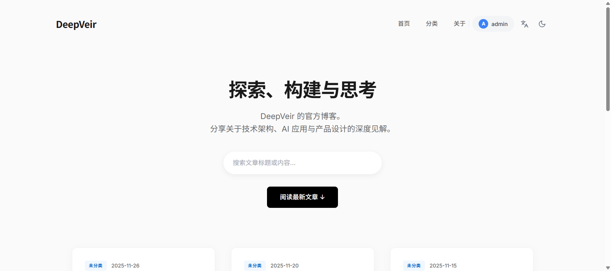
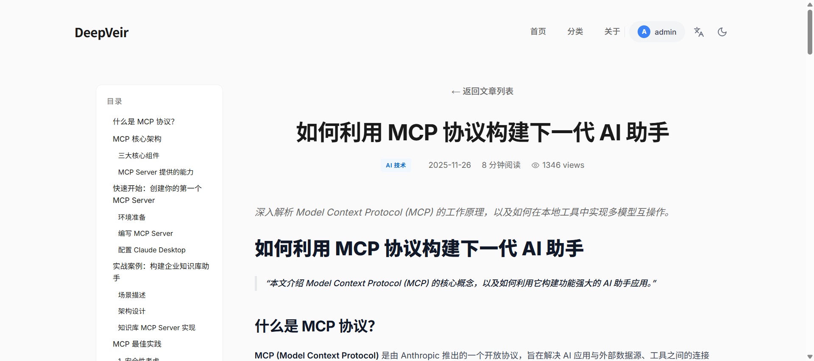
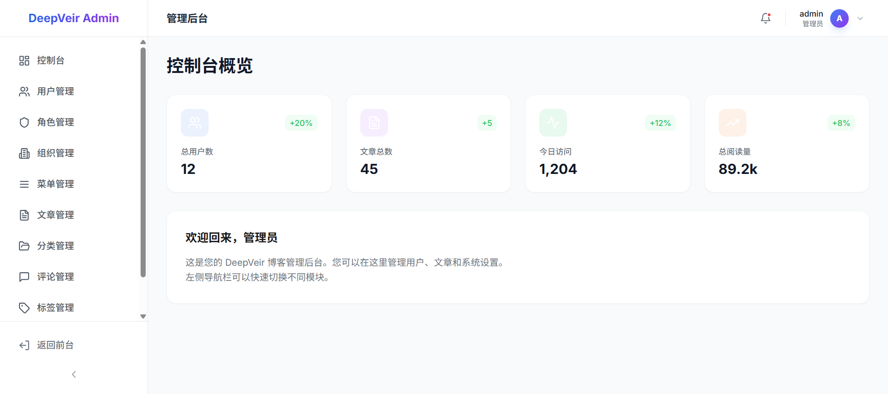

# DeepVeir Blog

<p align="center">
  <b>🚀 一个基于现代技术栈构建的前后端分离博客系统</b>
</p>

<p align="center">
  <b>Full-Stack Blog System | 全栈博客 | Next.js + Spring Boot</b>
</p>

<p align="center">
  
  
  
  
  
  
  
  
  
</p>

<p align="center">
  
  
</p>

---

> 🌐 **Keywords**: Blog, CMS, Full-Stack, Next.js, React, Spring Boot, Java, TypeScript, TailwindCSS, REST API, RBAC, i18n, 博客系统, 内容管理, 前后端分离

[项目介绍](#项目介绍) | [项目特性](#项目特性) | [技术选型](#技术选型) | [快速开始](#快速开始) | [项目截图](#项目截图) | [交流群](#交流群)

## 项目介绍

**DeepVeir Blog** 是一个基于现代技术栈构建的 **全栈博客系统 (Full-Stack Blog System)**，采用前后端分离架构。

- **后端**: Spring Boot 3 + Spring Security + Spring Data JPA + MySQL
- **前端**: Next.js 14 (App Router) + React 18 + TypeScript + TailwindCSS
- **特色**: 支持国际化 (i18n)、RBAC 权限管理、RESTful API

适用于个人博客、技术博客、内容管理系统 (CMS) 等场景。

## 项目特性

- ✅ **前后端分离** - 独立部署，API 驱动
- ✅ **现代化技术栈** - Java 17 + Next.js 14 + TypeScript
- ✅ **国际化支持** - 基于 next-intl 的多语言方案
- ✅ **权限管理** - RBAC 角色权限控制
- ✅ **安全认证** - Spring Security 安全框架
- ✅ **响应式设计** - TailwindCSS 适配移动端
- ✅ **SEO 友好** - Next.js SSR/SSG 支持
- ✅ **类型安全** - 全面使用 TypeScript

## 项目目录

```
blog/
├── blog-server/          # 后端服务 (Spring Boot)
│   ├── src/main/java/com/deepveir/blog/
│   │   ├── controller/   # API 控制器
│   │   ├── entity/       # JPA 实体类
│   │   ├── repository/   # 数据访问层
│   │   ├── service/      # 业务逻辑层
│   │   ├── dto/          # 数据传输对象
│   │   └── config/       # 配置类
│   └── pom.xml
├── blog-ui/              # 博客前端 (Next.js)
│   └── package.json
├── blog-manager-ui/      # 后台管理前端 (Next.js)
│   └── package.json
└── README.md
```

## 技术选型

### 后端技术

| 技术 | 说明 | 版本 |
| :---: | :---: | :---: |
| Spring Boot | 应用框架 | 3.2.5 |
| Spring Security | 认证和授权框架 | 6.x |
| Spring Data JPA | ORM 框架 | 3.x |
| MySQL | 关系型数据库 | 8.x |
| Lombok | 简化代码工具 | - |
| Java | 开发语言 | 17 |

### 前端技术

| 技术 | 说明 | 版本 |
| :---: | :---: | :---: |
| Next.js | React 全栈框架 | 14.2.3 |
| React | 前端框架 | 18.x |
| TypeScript | 类型安全的 JavaScript | 5.x |
| TailwindCSS | CSS 框架 | 3.4.1 |
| Lucide React | 图标库 | 0.378.0 |
| next-intl | 国际化 | 4.5.5 |

## 功能模块

### 核心实体

- **Article** - 文章管理
- **Category** - 分类管理
- **Tag** - 标签管理
- **User** - 用户管理
- **Role** - 角色权限管理
- **Menu** - 菜单管理
- **Organization** - 组织管理

### API 接口

- **AuthController** - 用户认证
- **ArticleController** - 文章 CRUD
- **CategoryController** - 分类 CRUD
- **TagController** - 标签 CRUD
- **UserController** - 用户管理
- **RoleController** - 角色管理
- **MenuController** - 菜单管理
- **OrganizationController** - 组织管理

## 快速开始

### 环境要求

- **JDK** 17+
- **Node.js** 18+
- **MySQL** 8.x
- **Maven** 3.8+

### 后端启动

```bash
# 进入后端目录
cd blog-server

# 配置数据库连接 (application.properties 或 application.yml)
# 修改 MySQL 连接信息

# 编译并启动
mvn spring-boot:run
```

### 前端启动（博客门户）

```bash
# 进入前端目录
cd blog-ui

# 安装依赖
npm install

# 启动开发服务器
npm run dev
```

### 后台管理启动

```bash
# 进入管理后台目录
cd blog-manager-ui

# 安装依赖
npm install

# 启动开发服务器
npm run dev
```

## 开发环境

| 工具 | 说明 |
| :---: | :---: |
| IntelliJ IDEA | Java 开发 IDE |
| VS Code | 前端开发 IDE |
| MySQL Workbench | 数据库管理 |
| Postman | API 调试 |

## 项目截图

### 博客前端

| 首页 | 文章详情 |
| :---: | :---: |
|  |  |

### 后台管理

| 登录页 | 仪表盘 |
| :---: | :---: |
|  |  |

| 文章管理 | 用户管理 |
| :---: | :---: |
|  |  |

## 交流群

如果在使用过程中遇到问题，欢迎加入交流群讨论！

| 微信群 | QQ群 |
| :---: | :---: |
|  |  |

> 💡 **Tips**: 微信群二维码过期可添加作者微信，备注「DeepVeir」拉群

| 作者微信 |
| :---: |
|  |

## 贡献指南

欢迎提交 Issue 和 Pull Request！

1. Fork 本仓库
2. 创建特性分支 (`git checkout -b feature/AmazingFeature`)
3. 提交更改 (`git commit -m 'Add some AmazingFeature'`)
4. 推送到分支 (`git push origin feature/AmazingFeature`)
5. 提交 Pull Request

## 开源协议

[MIT License](https://opensource.org/licenses/MIT)

---

<p align="center">
  如果这个项目对你有帮助，请给一个 ⭐ Star 支持一下！
</p>

---

**Related Keywords / 相关关键词**:
`blog system` `blog platform` `nextjs blog` `spring boot blog` `react blog` `typescript blog` `personal blog` `tech blog` `cms` `content management` `博客系统` `个人博客` `技术博客` `博客平台` `Next.js 博客` `React 博客` `Spring Boot 项目` `全栈项目` `前后端分离`
